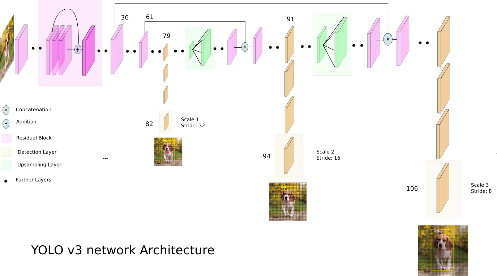
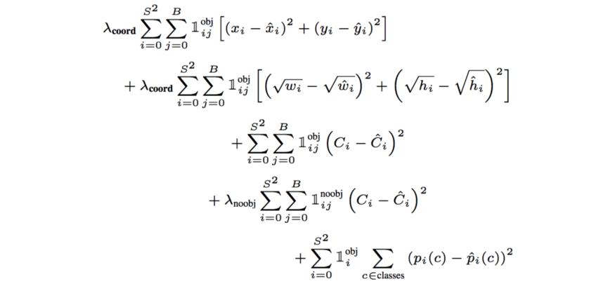
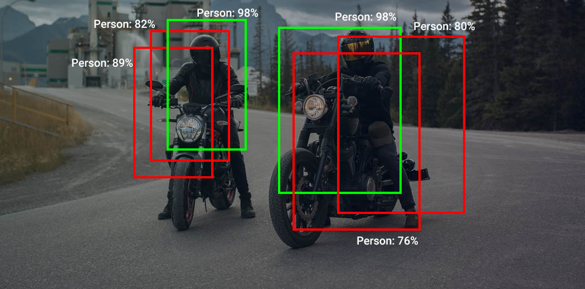
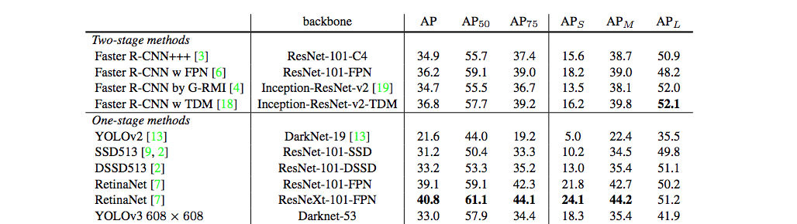
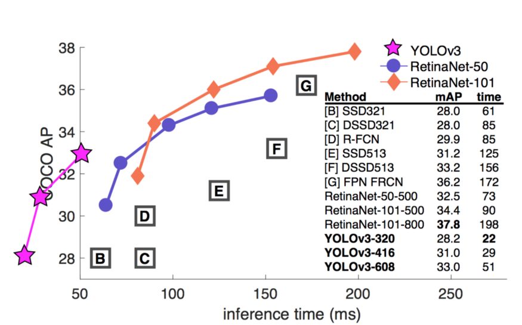

# YOLOv3 from Scratch: Analaysis and Implementation
 

In this project, I tried to establish a decent understanding from YOLO to see how the model works and the key that made it successful.To distinguish this project from others I have also implemented the YOLOv3 algorithm from scratch using PyTorch and explained the general architecture and algorithm itself.

## List of Content

- [Introduction to YOLO](#introduction-to-yolo)
- [YOLOv3](#YOLOv3)
- [Loss function](#loss-function)
- [Non-max Suppression](#son-max-suppression)
- [Results](#results)
- [Implementation](#implementation)
- [Requirements](#requirements)
- [Dataset](#dataset)
- [Conclusion](#conclusion)
- [Refrences](#refrences)

## Introduction to YOLO

YOLO is one of the famous object detection algorithms, introduced in 2015 by Joseph Redmon et al. Its idea is to detect an image by running it through a neural network only once, as its name implies( You Only Look Once). The advantage of using this method is it can locate an object in real-time. YOLO changed the view to the object detection problems; rather than looking at it as a classification problem, he did it as a regression problem. He used a neural network as a backbone and calculated associate class probabilities.

## YOLOv3

After the original YOLO paper, the second version of YOLO was released. It improved the algorithm by making it faster and more robust. After that, a couple of years down the line, other models like SSD outperformed this model with higher accuracy rates. However, it was still the fastest model out there because of its single neural network approach. When the third version came out, they decided to sacrifice the speed and make it a bit slower (from 45 FPS to 30 FPS). Using a deeper network, they doubled the convolution layers and increased the backbone architecture model they called DarkNet.

The third version of the algorithm tried to use state-of-the-art strategies to create a more robust network. It incorporated residual networks, skip connections, and upsampling to a good extend. Moreover, this version of YOLO took advantage of 1x1 kernels in Conv layers, a common technique nowadays. Essentially, it does a one-by-one mapping, but if implemented correctly, it can reduce the computational complexity a lot. I suggest reading [this](https://stats.stackexchange.com/questions/194142/what-does-1x1-convolution-mean-in-a-neural-network) comment if you need more exact information about that topic. Down below, you can see a detailed illustration of the model architecture made by [Ayoosh Kathuria](https://medium.com/@ayoosh).

As shown in the image, there are three stages in which the image is being downsampled, precisely 32, 16, and 8, respectively.

YOLO v3, in total, uses nine anchor boxes. Three for each scale. If you’re training YOLO on your dataset, you should go about using K-Means clustering to generate nine anchors.
Then, arrange the anchors in descending order of a dimension. Assign the three most significant anchors for the first scale, the following three for the second scale, and the last three for the third.

## Loss Function

The YOLO loss function consists of 3 parts that sums up to generate an overall loss:

     - The classification loss.
     - The confidence loss (the objectness of the box).
     - The localization loss (errors between the predicted boundary box and the ground truth).

The image below shows the Loss function taken from paper: 

## Non-max Suppression

One of the problems in object detection is the algorithm detects the same object multiple times. In the YOLO algorithm, because of its grid-like strategy, it is suspect to this issue; Non-max Suppression helps solve this issue.
Let's say we have a pedestrian in the image, and the algorithm finds not just one central point for that particular object, and due to multiple center points, it creates multiple bounding boxes around the same object.

To overcome this issue using non-max suppression, it finds the bounding box with the highest precision. It eliminates the other bounding boxes with a high IOU(intersection over union) with the selected bounding box.
As the name implies, it suppresses the bounding boxes that don't have a maximum confidence value.

## Results

In computer vision, calculating how precise algorithms are using mAP(mean average precision) is a well-known method. It uses the IOU evaluation metric discussed in the previous section by calculating the union between the predicted bounding box and ground truth.
In different challenges, the definition of mAP might be a bit different for instance:
    
    "In PASCAL VOC2007 challenge, AP for one object class is calculated for an IoU threshold of 0.5. So the mAP is averaged over all object classes."
    
    "For the COCO 2017 challenge, the mAP is averaged over all object categories and 10 IoU thresholds."
    
In the table below, you can see the performance of YOLOv3 in comparison to other competitors. The AP metric is subject to maximization.

However, YOLO outperforms all other models when it comes to speed.

# Implementation
[Comments and description of .py files are not done yet.]

## Dataset

The model can be trained on either The PASCAL Visual Object Classes or MS-COCO dataset, depending on performance of your machine. Training on MS-COCO can be more computitionaly expensive. I trained the model on VOC dataset and I have  created a weights file that you can use to test the model. Its about 700 Mb, I can send you the file upon your request.

## Requirements

Python 3.8.6, Torch 1.8.1, OpenCv and other common packages listed in `requirements.txt`.

You can use `$ pip install -r requirements.txt` inside your virtual environment to install them all or do it manually.

To download the dataset to train the model, you need to download one of these datasets:

#### 1. MS-COCO Dataset

Create a folder called dataset in the root level (where the train.py is). Inside the dataset folder, follow the instructions on this page: http://cocodataset.org/#download

    mkdir val
    mkdir train
    mkdir test
    gsutil -m rsync gs://images.cocodataset.org/val2017 val
    gsutil -m rsync gs://images.cocodataset.org/train2017 train
    gsutil -m rsync gs://images.cocodataset.org/test2017 test
    
Also, download the annotations as well:

    wget http://images.cocodataset.org/annotations/annotations_trainval2017.zip
    unzip annotations_trainval2017.zip
    

#### 2. VOC 2007 Dataset

In the dataset directory:

    wget http://host.robots.ox.ac.uk/pascal/VOC/voc2007/VOCtrainval_06-Nov-2007.tar
    tar -xvf VOCtrainval_06-Nov-2007.tar
    wget http://host.robots.ox.ac.uk/pascal/VOC/voc2007/VOCtest_06-Nov-2007.tar
    tar -xvf VOCtest_06-Nov-2007.tar
    wget http://host.robots.ox.ac.uk/pascal/VOC/voc2007/VOCtestnoimgs_06-Nov-2007.tar

## Conclusion

YOLOv3, without a doubt, is one of the most impactful models in computer vision history. It created many opportunities for people in the field to use it to their advantage and researchers to get a new point of view. A hands-on project on YOLOv3 gave me a great understanding of convolution neural networks in general and many state-of-the-art methods. Moreover, I want to push it further by combining it with an LSTM(long short-term memory) algorithm like Deep SORT and create a object and pedestrian tracker. All-in-all I hope others find this project useful and make use of this in their journey. 

## Refrences

   ### Papers
   
> - [YOLOv3: An Incremental Improvement](https://arxiv.org/pdf/1804.02767)
> - [You Only Look Once: Unified, Real-Time Object Detection](https://arxiv.org/pdf/1506.02640)
> - [Object Detection and Tracking Algorithms for
Vehicle Counting: A Comparative Analysis](https://arxiv.org/ftp/arxiv/papers/2007/2007.16198.pdf)
> - [YOLO9000: Better, Faster, Stronger](https://arxiv.org/pdf/1612.08242)

  ### other refrences

> - [YOLOv3 — Real-time object detection](https://medium.com/analytics-vidhya/yolov3-real-time-object-detection-54e69037b6d0)
> - [Dive Really Deep into YOLO v3: A Beginner’s Guide](https://towardsdatascience.com/dive-really-deep-into-yolo-v3-a-beginners-guide-9e3d2666280e)
> - [What’s new in YOLO v3?](https://towardsdatascience.com/yolo-v3-object-detection-53fb7d3bfe6b)
> - [Real-time Object Detection with YOLO, YOLOv2 and now YOLOv3](https://jonathan-hui.medium.com/real-time-object-detection-with-yolo-yolov2-28b1b93e2088)