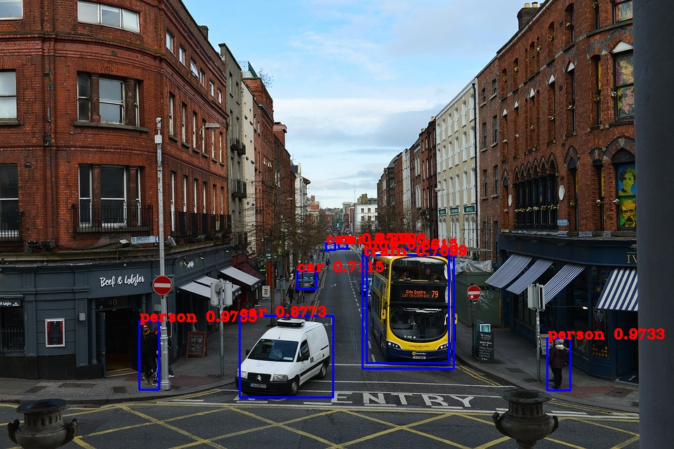

# YOLOv3 from Scratch: Analaysis and Implementation
 

In this project, I tried to establish a decent understanding from YOLO to see how the model works and the key that made it successful. I have implemented the YOLOv3 algorithm from scratch using PyTorch and explained the general architecture and algorithm itself.

## List of Content

- [Introduction](#introduction)
- [Introduction](#introduction)
- [Introduction](#introduction)
- [Introduction](#introduction)
- [Introduction](#introduction)
- [Introduction](#introduction)
- [Introduction](#introduction)

## Introduction to YOLO

YOLO is one of the famous object detection algorithms, introduced in 2015 by Joseph Redmon et al. Its idea is to detect an image by running it through a neural network only once, as its name implies( You Only Look Once). The advantage of using this method is it can locate an object in real-time. YOLO changed the view to the object detection problems; rather than looking at it as a classification problem, he did it as a regression problem. He used a neural network as a backbone and calculated associate class probabilities.
